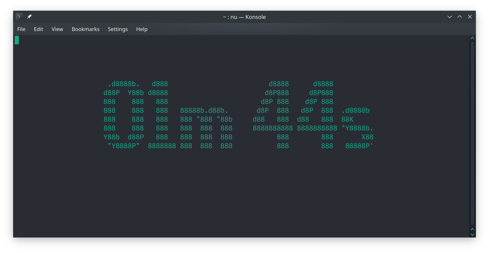

<p align="center"></p>

>"28 days, 6 hours, 42 minutes, 12 seconds. That is when the world will end."
>
> -- <cite>Frank the Rabbit</cite>


# Frankmer
## Frank + Timer = "frankmer"


A simple command line timer built with Rust, inspired by Frank the rabbit (or more accurately, the a man in a stupid bunny suit), from the film "Donnie Darko".  
Frank + timer = "frankmer"...

It uses FIGlet fonts, and the standard library `time` package for the timings, and then the fabulous `crossterm` and `clap` Crates for the CLI and terminal handling.

## Installation
The easiest way to install Frankmer is to use cargo, and install it directly from github.
```bash
cargo install --git https://github.com/jinlow/frankmer.git --branch main
```

## API

After installation, the easiest way to use the application is running `frankmer` in the terminal with the time shortcut commands. These should be passed as integer values, suffixed with either "h", "m", or "s" to specify the hours, minutes, or seconds to initialize the timer with. For example:

```bash
> frankmer 1h 10m 24s
```
Will start the timer with 1 hour, 10 minutes and 24 seconds.

```bash
> frankmer 3m
```

Will start the timer with 3 minutes.

Optionally, the flags `-H`, `-M`, or `-S` can be passed followed by an integer value to specify hours, minutes or seconds to initialize the timer with respectively. 
For example:
```bash
> frankmer -M 5 -S 30
```
Will initialize the timer with 5 minutes and 30 seconds.

Simply running the command `frankmer` without any arguments will print out the help for the command.
```bash
> frankmer
```
```
frankmer 0.1.0
A simple timer for the command line.

USAGE:
    frankmer [OPTIONS] [time]...

FLAGS:
    -h, --help       Prints help information
    -V, --version    Prints version information

OPTIONS:
    -H, --hour <N_HOURS>         The number of hours to start the timer with.
    -M, --minutes <N_MINUTES>    The number of minutes to start the timer with.
    -S, --seconds <N_SECONDS>    The number of seconds to start the timer with.

ARGS:
    <time>...    The time used to initialize the timer with.
                 This must be the time separated by spaces describing the
                 hours (h), minutes (m), and seconds (s) to start the timer with.
                 The 'h', 'm', and 's' post fixes can be used on an integer to specify
                 the hours, minutes or seconds respectively to start the timer with.
                 If this is not set, at least one of the '--hour', '--minutes' or 
                 '--seconds' flags must be set. Refer to the help for these options for
                 more details.
                 For example passing:
                     - 'frankmer 1h 10m 24s': Start the timer with one hour,
                                               10 minutes and 24 seconds.
                     - 'frankmer 3m': Start the timer with 3 minutes.

```

## Goals
A few things I would like to add...
  - [ ] Styling of timer output in the terminal. This could possibly be handled by a ".config" file.
  - [ ] Add option to open a new window, with the timer
  option so that you could continue to use the terminal.

-----
> Donnie: "Why do they call you Frank?" 
>
> Frank: "It is the name of my father… and his father before me."

> Donnie: "Why do you wear that stupid bunny suit?"
>
> Frank: "Why are you wearing that stupid man suit?" 
